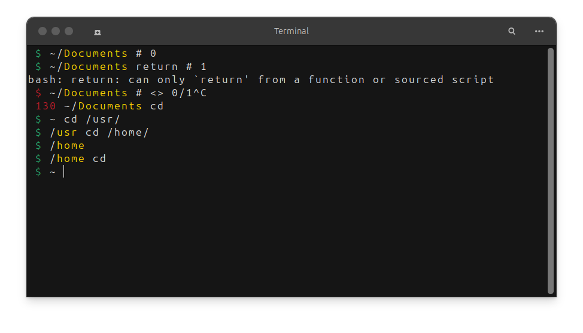

## Setup
```shell
git clone https://github.com/rootfebri/termc.git ~/termc
cd termc
```
```shell
echo "" >> ~/.bashrc
echo "source ~/termc/.conf" >> ~/.bashrc
source ~/.bashrc
```
<div align="center">
    <a href="./">
        
    </a>
</div>
